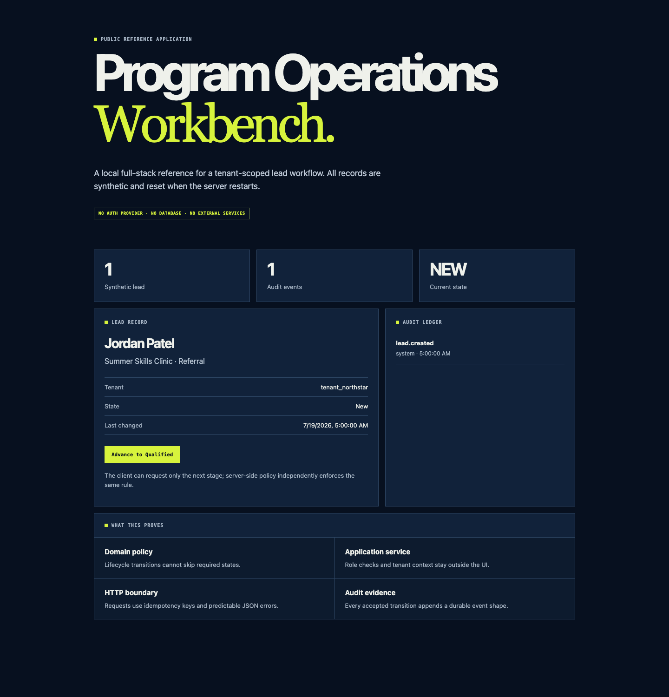

# Program Operations Reference

An original, code-first reference application demonstrating how I structure a workflow-heavy product across domain logic, an HTTP API, a browser client, and automated tests.



## What this demonstrates

- tenant-scoped reads and writes;
- explicit lead lifecycle transitions;
- role-based action checks;
- request-level idempotency for safe retries;
- append-only audit events;
- input validation and predictable HTTP errors;
- a small browser client consuming the same API;
- unit and API integration tests.

## Why this is public

This is a sanitized reference implementation, not a copy of a private production application. It uses original code and invented data. The corresponding production systems remain private because they contain proprietary workflow logic, client and family data models, integration boundaries, credentials, and security-sensitive implementation details.

## Run it

Requires Node.js 20 or later.

```bash
npm test
npm start
```

Open `http://localhost:4173`. The browser client is served by the local Node server and reads/writes only in-memory synthetic records.

## Architecture

```text
Browser client
  ↓
HTTP API
  ↓
Application service
  ↓
Domain transition policy + authorization checks
  ↓
In-memory repository + audit ledger + idempotency store
```

The in-memory adapters are intentional for a public reference project. A production deployment would replace them with authenticated, tenant-isolated durable storage, observability, rate limiting, and provider adapters.

## Repository layout

| Path | Responsibility |
| --- | --- |
| `src/domain/` | Lead lifecycle rules and validation. |
| `src/application/` | Use cases and authorization decisions. |
| `src/infrastructure/` | In-memory repository and idempotency adapter. |
| `src/http/` | HTTP boundary and static asset serving. |
| `public/` | Browser client and presentation layer. |
| `tests/` | Domain, service, and HTTP integration tests. |

## Portfolio

[Pranavv Rajamani — Portfolio](https://pranavv-rajamani-portfolio.pranavvrajamani9.chatgpt.site) · [GitHub profile](https://github.com/pranavvrajamani9-lgtm) · [Contact](mailto:pranavv@prsm360.com)
